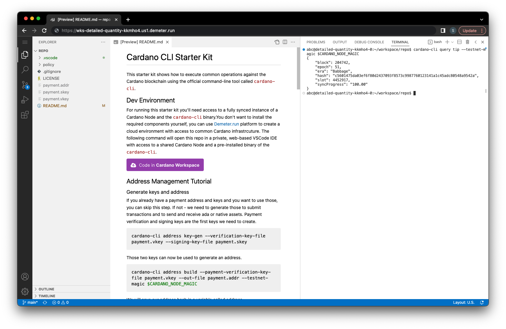

# Cardano CLI Starter Kit

This starter kit shows how to execute common operations against the Cardano blockchain using the official command-line tool called `cardano-cli`.

## Dev Environment

For running this starter kit you'll need access to a fully synced instance of a Cardano Node and the `cardano-cli` binary.

You don't want to install the required components yourself, you can use [Demeter.run](https://demeter.run) platform to create a cloud environment with access to common Cardano infrastrcuture. The following command will open this repo in a private, web-based VSCode IDE with access to a shared Cardano Node and a pre-installed binary of the `cardano-cli`.

[](https://demeter.run/code?repository=https://github.com/txpipe/cardano-cli-starter-kit.git&template=typescript)

## Navigating the Starter Kit

This starter kit is organized as interactive documentation where you can try out the commands as you move along in each topic.

### Screen Layout

The docs assume that you're reading this guide inside a Cardano Workspace, we recommend splitting your editor into two different panes, with the README on the left and the terminal on the right.



Whenever you see an example bash snippet as a step in any of the tutorials, you can copy & paste it into the embedded terminal on the right, this will give you inmediate and real feedback of each command.

### Cardano Node Access

Since you're running this starter kit from a _Cardano Workspace_, you already have access to the required infrastrcuture, such as the Cardano Node. All the required binaries are pre-installed by default, including the `cardano-cli`.

The network to which you're connected (mainnet, preview, preprod, etc) is defined by your project's configuration, selected at the moment of creating your environment.

To simplify the overall process, _Cardano Workspaces_ come already configured with specific environmental variables that allows you to connect to the node without extra step. These are the variables relevant for this particular tutorial:

- `CARDANO_NODE_SOCKET_PATH`: provides the location of the unix socket within the workspace where the cardano node is listening to.
- `CARDANO_NODE_MAGIC`: the network magic corresponding to the node that is connected to the workspace.

To ensure that you're connected to the node, try running the following command which outputs the current tip of the node:

```sh
cardano-cli query tip --testnet-magic $CARDANO_NODE_MAGIC
```

if everything worked correctly, you should see an output similar to this one:

```json
{
    "block": 204803,
    "epoch": 51,
    "era": "Babbage",
    "hash": "e2de3e03c45787e1f20609ed5f9a71098b0cb75e52abca459db34354cab29423",
    "slot": 4454222,
    "syncProgress": "100.00"
}
```

## Table of Contents

The following list describes the different parts of the tutorial. We recommend following them in order since each one provides instructions and resources that might be required to execute later steps.

### 1. [Account Management](./01-account-management.md)

Explains how to create signing keys and addresses that represent your account while interacting with the blockchain.

### 2. [Build Transactions](./02-build-transactions.md)

Explains how to build a simple ADA transfer transaction and submit it onto the blockhain.

### 3. [Mint Native Assets](./03-mint-native-assets.md)

Explains how to mint custom native assets and transfer those assets to other addresses.
